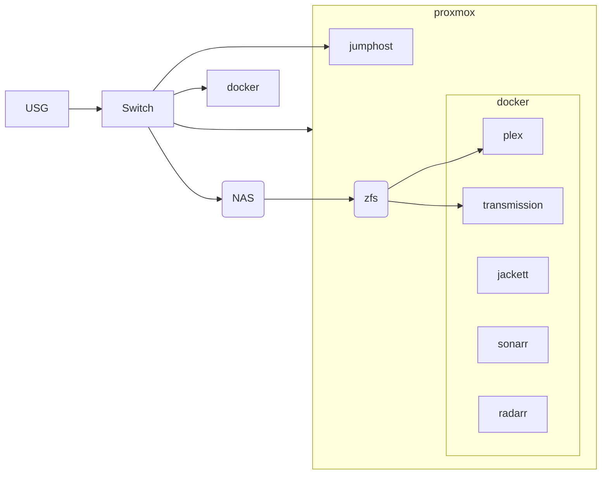

# TOBIAS SVEDBERG
CLOUD ENGINEER 📌NORRKÖPING, SWEDEN 📞0707525998

## KONTAKTUPPGIFTER
Norrköping
Sweden 
0707525998 
tobias@svedberg.io

*Födelsedatum* 
19880222

## LÄNKAR
- LinkedIn
  
## KOMPETENS
- Linux 🟦🟦🟦🟦🟦
- Bash/Zsh 🟦🟦🟦🟦🟦
- Nätverk 🟦🟦🟦🟦⏹️
- Docker 🟦🟦🟦⏹️⏹️
- Git 🟦🟦🟦⏹️⏹️
- Azure 🟦🟦🟦⏹️⏹️
- SQL 🟦🟦🟦⏹️⏹️
- CI/ID 🟦🟦⏹️⏹️⏹️
- Terraform 🟦🟦⏹️⏹️⏹️
- Pentesting 🟦🟦⏹️⏹️⏹️
## SPRÅK
- Svenska 🟦🟦🟦🟦🟦
- Engelska 🟦🟦🟦🟦⏹️

## PROFIL
Mångsidig DevOps engineer med över 10 års arbetserfarenhet inom IT. Konstruerar,
automatiserar och optimerar leveransen för bolagskritiska applikationer. Målet är att all
distribution ska strömlinjeformas oavsett om det är on premies eller Cloud.

## ARBETSLIVSERFARENHET
__Cloud Engineer på Phoniro ASSA ABLOY Global Soultions, Norrköping__ 
*februari 2020 — Nuvarande* 
Lead DevOps Engineer - Jag leder ett agilt team på 3 passionerade individer - konstruerar
serverlösa plattformar för greenfield -appar eller lurar brownfield -appar till att köra
på containrar. Automatiserar distribution av .Net applikationer på Windows serverar.
Hanterar och förvaltar CI/CD pipelines med Terraform i Azure DevOps för att distrubera
kod för Azure tjänster.

__Security Champion__ - Ansvarar för att alla driftplattformar efterföljer företagsförordnader
gällande IT-säkerhet.

__Supporttekniker på Phoniro ASSA ABLOY Global Soultions, Norrköping__ 
*oktober 2016 — februari 2020* 
Tillhandahöll support för sveriges kommuner och regioner där support och felsökning
omfattade ett brett utbud av produkter och tjänster, allt från våra webb- och
mobilapplikationer till IIS och SQL på serversidan.

__Servicetekniker på Qstar Försäljning, Norrköping__ 
*oktober 2013 — oktober 2016* 
Monitorerade och underhöll mer än 400 obemannade bensinstationer. Övervakning
av korttransaktioner från betalterminaler, larm- och kameraövervakning, PLC
programmering, reparation av kortterminaler och kvittoskrivare.

__Teknisk Support på Transcom, Norrköping__ 
*januari 2009 — oktober 2013* 
__Team Leader__ - Sammanställde statistik, hanterade feedback från vår konsumenter. Såg
till att min grupp trivdes bra och kan presterade väl. 
__Utbildningsansvarig/Produktspecialist__ - Ansvarade för utbildning och coachning i
kundkommunikation, teknisk plattform och aktuella processer och rutiner. Agerade
produktstöd för komplexa ärenden och problem som inte kunde hanteras av fist line
support. 
__Fist line support__ - Arbetade för en av Sveriges ledande ISP: er där jag besvarade
inkommande samtal för tjänster som VoIP, xDSL och LAN -anslutningar. L2 och L3
felsökning av plattformar som Cisco, Ericsson, Nokia, Alcatel-Lucent, Huawei.

## UTBILDNING
__Handel- och Administrationsprogrammet, Nyströmska Skolan, Söderköping__ 
*2004 — 2007* 
## REFERENSER
__Referenser lämnas ut på begäran__
